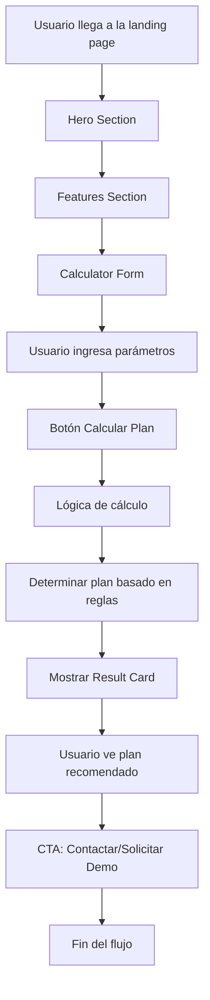

# Plan de Desarrollo: Landing Page Mainbrain ERP

## Descripción del Proyecto

Desarrollar una landing page moderna y atractiva en React para calcular planes de licenciamiento de "Mainbrain ERP". La aplicación permitirá a los usuarios ingresar parámetros (nivel de desarrollo, dimensión del proyecto y transacciones diarias) y obtener automáticamente el plan recomendado con su costo.

## Tecnologías Utilizadas

-  **React**: Framework principal para la interfaz de usuario.
-  **Vite**: Herramienta de construcción rápida para desarrollo.
-  **TailwindCSS**: Framework CSS para estilos responsivos y modernos.
-  **Framer Motion**: Librería para animaciones suaves.
-  **React Hooks**: Para manejo de estado global simple.

## Estructura de la Aplicación

La landing page tendrá las siguientes secciones principales:

1. **Hero Section**: Título llamativo, descripción breve y botón CTA.
2. **Features/Beneficios**: Lista de ventajas del sistema ERP.
3. **Calculator**: Formulario para ingresar parámetros y calcular el plan.
4. **Result**: Tarjeta que muestra el plan asignado dinámicamente.
5. **Footer**: CTA final para contactar o solicitar demo.

## Lógica de Cálculo de Planes

Basada en la tabla proporcionada:

| Plan   | Nivel  | Dimensión (USD) | Transacciones Diarias | Costo (Bs) |
| ------ | ------ | --------------- | --------------------- | ---------- |
| Básico | Mínimo | < 1K            | ≤ 300                 | 350        |
| Pyme   | Básico | 1K - 5K         | ≤ 300                 | 400        |
| Medium | Alto   | 5K - 10K        | ≤ 1500                | 500        |
| Plus   | Plus   | 10K - 30K       | Ilimitadas            | 750        |
| Max    | Plus   | 30K - 100K      | Ilimitadas            | 1500       |
| Super  | Plus   | > 100K          | Ilimitadas            | 2500       |

## Lista de Tareas

1. Inicializar proyecto React con Vite en el directorio raíz
2. Instalar dependencias: TailwindCSS, Framer Motion y otras necesarias
3. Crear estructura de carpetas y archivos base (src/components, etc.)
4. Implementar componente Hero con título, descripción y botón CTA
5. Implementar sección Features/Beneficios con lista de ventajas
6. Crear componente Calculator con formulario (nivel, dimensión, transacciones)
7. Implementar lógica de cálculo del plan basada en la tabla proporcionada
8. Crear componente Result para mostrar el plan asignado dinámicamente
9. Implementar sección Footer con CTA final (Contactar/Solicitar demo)
10.   Agregar animaciones con Framer Motion (hero, resultado, transiciones)
11.   Asegurar diseño responsive para móviles y escritorio
12.   Configurar estado global con React hooks para formulario y resultado
13.   Probar funcionalidad completa y ajustar estilos

## Diagrama de Flujo de la Aplicación

## Arquitectura de Componentes

-  **App.jsx**: Componente principal que orquesta todas las secciones.
-  **Hero.jsx**: Sección hero con animaciones.
-  **Features.jsx**: Lista de beneficios con íconos.
-  **Calculator.jsx**: Formulario con validación y estado.
-  **Result.jsx**: Tarjeta de resultado con animación de entrada.
-  **Footer.jsx**: Sección final con CTA.
-  **hooks/useCalculator.js**: Hook personalizado para lógica de cálculo y estado.

## Consideraciones Técnicas

-  **Responsive Design**: Utilizar clases de TailwindCSS para diferentes breakpoints.
-  **Animaciones**: Framer Motion para transiciones suaves en carga de resultados y navegación.
-  **Estado**: useState y useEffect para manejar formulario y resultados.
-  **Validación**: Validación básica en inputs numéricos y select.
-  **Modularidad**: Componentes separados y reutilizables.

## Próximos Pasos

Una vez aprobado este plan, procederemos a la implementación en modo Code. El desarrollo se realizará de manera incremental, siguiendo el orden de las tareas para asegurar una construcción sólida y funcional.
